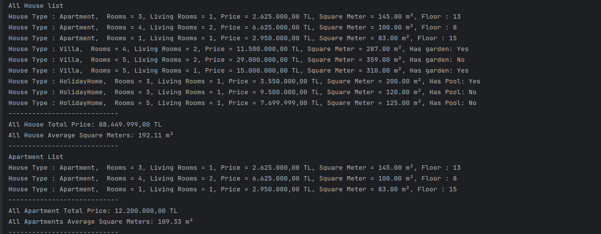
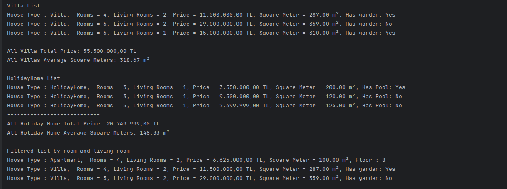

# House Types
 
Bu proje, farklı türde evlerin (Daire, Villa, Yazlık) yönetildiği bir emlak sistemini simüle eder. Her ev türü ve tüm evler için toplam fiyat ve ortalama metrekare hesaplamaları yapılır. Ayrıca, evleri oda sayısı ve salon sayısına göre filtreleyebilirsiniz.

Özellikler

    Farklı ev türlerini yönetme: Daire, Villa ve Yazlık.

    Her ev türü ve tüm evler için toplam fiyat hesaplama.

    Her ev türü ve tüm evler için ortalama metrekare hesaplama.

    Oda sayısı ve salon sayısına göre evleri filtreleme.

Programın Çıktısı 1 :

Programın Çıktısı 2 :
